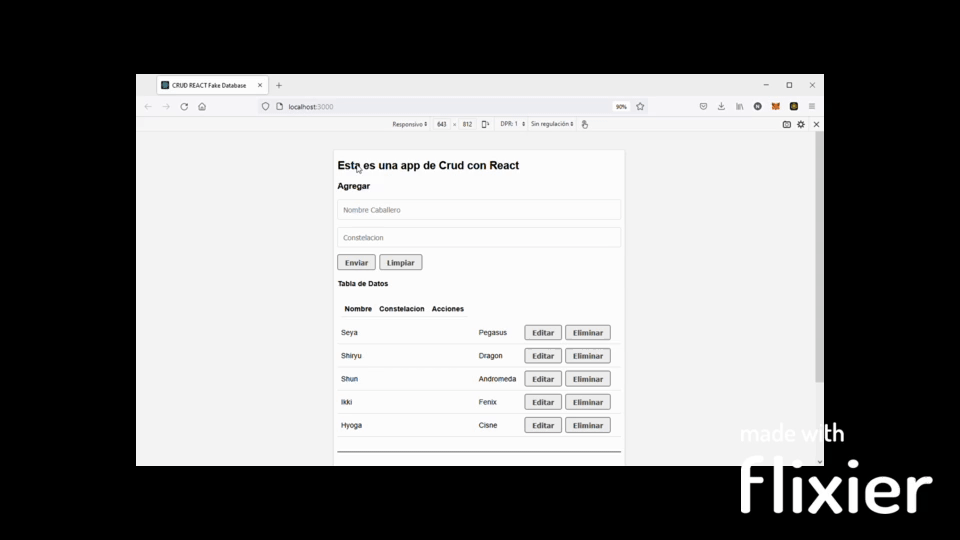

# Crud App with React

Create, Read, Update and Delete with React making styles and responsive with CSS 

Este proyecto fue maquetado principalmente con [Create React App](https://github.com/facebook/create-react-app). 

# Tabla de contenidos

- [Instalación](#Instalación)
- [Uso](#Uso)

# Instalación 

- Clonar el repositorio.
- Utilizar `npm install` en el directorio raiz.
- Luego `npm start`.

# Uso
Permite agregar y editar mediante el uso de un mismo formulario , se crea una tabla dinamicamente.

### Navegando el Sitio

# Creditos

Este trabajo fue desarrollado por [@nachom48](https://github.com/nachom48) haciendo referencia a Jon Mircha y sus tutoriales en youtube.
